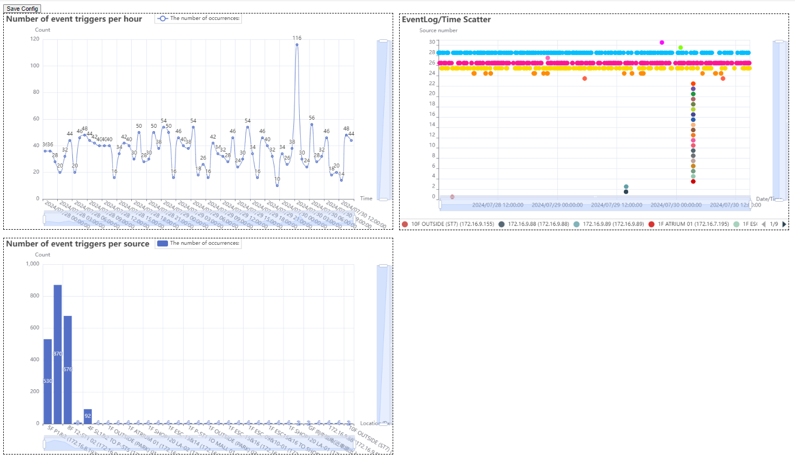

# NX Log to Chart Converter

## 概述

這個程式將NX log匯出的HTML數據轉換為可視化圖表，其中的用途是可以幫助用戶分析網路問題。透過散點圖和其他圖表，您可以輕鬆識別和診斷設備故障。而且更可以把其他Log的信息製成圖表。

## 功能

- **基於source的發生次數的棒形圖分析**：顯示某來源的觸發次數。
- **基於時間的發生次數的棒形圖分析**：顯示某時間點的觸發次數。
- **觸發時間的散點圖分析**：以散點時間軸顯示log事件發生情況。
- **簡單易用的工具**：容易上手，方便操作。
- **友好的圖表顯示**：可以任意放大縮小圖表。

## 具體操作

**1 :Export network issue logs to html**

**2 :Generate charts**

**3 :Common reasons for network camera disconnection**

**4 :Ask chatgpt a question**

## 使用案例

1.我曾經在一座大樓中，當所有攝影機同時斷線時，我利用這個程式進行分析，最終確認了整座建築的電力異常，並發現某些樓層的UPS也有問題。

2.可以利用在人流統計表

